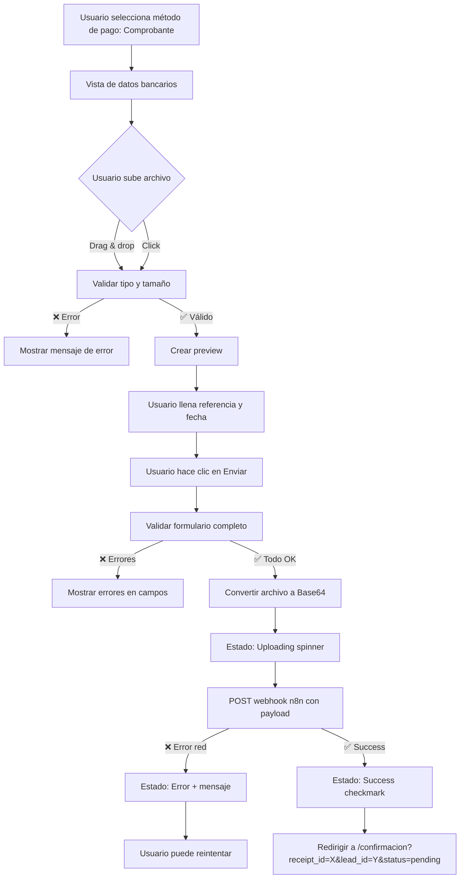

# 🏦 Configuración de Comprobante Bancario - Abogados Liberales

## ✅ Implementación Completada (FASE 6)

### Funcionalidades Implementadas

✅ **Uploader de Archivos**
- Drag & drop de archivos PDF, JPG, PNG
- Click para seleccionar archivo
- Validación de tipo (solo PDF/JPG/PNG permitidos)
- Validación de tamaño (máximo 5MB)
- Mensajes de error descriptivos

✅ **Preview del Archivo**
- Preview de imágenes con thumbnail
- Preview de PDF con ícono y metadatos (nombre, tamaño)
- Botón para eliminar archivo seleccionado
- Formateo de tamaño de archivo (KB/MB)

✅ **Formulario Completo**
- Campo de número de referencia (obligatorio, min 5 caracteres)
- Campo de fecha de pago (obligatorio, no futura, máx 30 días atrás)
- Validación en tiempo real con estados `touched` y `errors`
- Conversión de archivo a Base64 para envío

✅ **Estados Visuales**
- **Uploading**: Spinner con mensaje "Subiendo comprobante..."
- **Success**: Checkmark verde con mensaje de confirmación + redirect
- **Error**: Cruz roja con mensaje descriptivo
- Animaciones suaves (`fadeInScale`, `scaleUp`)

✅ **Integración con Webhook n8n**
- Endpoint configurado: `https://u-n8n.virtalus.cbluna-dev.com/webhook/congreso_nacional_upload_receipt`
- Payload incluye: lead_id, event_id, receipt_file (base64), file_name, file_type, amount, currency, reference_number, payment_date, timestamp

✅ **Responsive Design**
- Breakpoints: 768px y 480px
- Drop zone adaptativo (padding reducido en móvil)
- Preview de imagen con max-height ajustable
- Formulario con inputs responsive

---

## 📋 Estructura de Datos

### Payload del Webhook (Subida de Comprobante)

```json
{
  "lead_id": 123,
  "event_id": 1,
  "receipt_file": "data:application/pdf;base64,JVBERi0xLjQKJeLjz9MK...",
  "file_name": "comprobante_pago.pdf",
  "file_type": "application/pdf",
  "amount": 1990.00,
  "currency": "MXN",
  "reference_number": "REF123456",
  "payment_date": "2025-01-15T00:00:00.000Z",
  "timestamp": "2025-01-15T18:30:45.123Z"
}
```

### Validaciones del Formulario

| Campo | Validación | Mensaje de Error (ES) | Mensaje de Error (EN) |
|-------|------------|----------------------|----------------------|
| **Archivo** | Tipo: PDF/JPG/PNG | "Solo se permiten archivos PDF, JPG y PNG" | "Only PDF, JPG, and PNG files are allowed" |
| | Tamaño: < 5MB | "El archivo debe ser menor a 5MB" | "File size must be less than 5MB" |
| | Requerido | "Archivo de comprobante requerido" | "Receipt file is required" |
| **Número de Referencia** | Min 5 caracteres | "Número de referencia muy corto" | "Reference number too short" |
| | Requerido | "Número de referencia requerido" | "Reference number is required" |
| **Fecha de Pago** | No futura | "La fecha no puede ser futura" | "Payment date cannot be in the future" |
| | Máx 30 días atrás | "La fecha no puede ser mayor a 30 días" | "Payment date cannot be more than 30 days ago" |
| | Requerido | "Fecha de pago requerida" | "Payment date is required" |

---

## 🔄 Flujo Completo de Comprobante Bancario



---

## 📝 Datos Bancarios Mostrados

```jsx
Banco: Bancomer (BBVA México)
CLABE: 012180001234567890
Beneficiario: Barra Mexicana de Abogados Liberales A.C.
```

Estos datos se muestran **antes** del formulario de subida para que el usuario pueda realizar la transferencia.

---

## 🎨 Componentes CSS

### Clases Principales

- `.receiptForm` - Contenedor del formulario
- `.dropZone` - Zona de drag & drop (con estados hover y error)
- `.filePreview` - Contenedor del preview del archivo
- `.previewImage` - Imagen thumbnail (max 400px width, 300px height)
- `.pdfPreview` - Preview de PDF con ícono y metadatos
- `.removeButton` - Botón para eliminar archivo (rojo con hover)
- `.input` - Inputs estándar con focus azul
- `.submitButton` - Botón con gradiente azul→dorado en hover
- `.infoBox` - Banner informativo con icono ℹ️

### Estados Visuales

- `.uploadingState` - Spinner azul con mensaje de carga
- `.successState` - Checkmark verde con animación `scaleUp`
- `.errorState` - Cruz roja con mensaje descriptivo

### Animaciones

```css
@keyframes spin {
  to { transform: rotate(360deg); }
}

@keyframes fadeInScale {
  from { opacity: 0; transform: scale(0.95); }
  to { opacity: 1; transform: scale(1); }
}

@keyframes scaleUp {
  0% { transform: scale(0); }
  50% { transform: scale(1.1); }
  100% { transform: scale(1); }
}
```

---

## 🧪 Testing

### Casos de Prueba

#### 1. **Validación de Archivo**
- ✅ Subir PDF válido (< 5MB) → Debe mostrar preview
- ✅ Subir JPG válido (< 5MB) → Debe mostrar thumbnail
- ❌ Subir archivo > 5MB → Error: "El archivo debe ser menor a 5MB"
- ❌ Subir .docx o .txt → Error: "Solo se permiten archivos PDF, JPG y PNG"

#### 2. **Validación de Referencia**
- ✅ Ingresar "REF123456" → Válido
- ❌ Ingresar "REF" → Error: "Número de referencia muy corto"
- ❌ Dejar vacío → Error: "Número de referencia requerido"

#### 3. **Validación de Fecha**
- ✅ Seleccionar fecha de hoy → Válido
- ✅ Seleccionar fecha 10 días atrás → Válido
- ❌ Seleccionar fecha mañana → Error: "La fecha no puede ser futura"
- ❌ Seleccionar fecha > 30 días atrás → Error: "La fecha no puede ser mayor a 30 días"

#### 4. **Flujo Completo**
1. Subir archivo válido
2. Llenar número de referencia "REF789"
3. Seleccionar fecha de hoy
4. Click en "Enviar Comprobante"
5. Ver spinner "Subiendo comprobante..."
6. Ver checkmark verde "¡Comprobante subido!"
7. Redirect a `/confirmacion?receipt_id=REF789&lead_id=123&status=pending` después de 3s

---

## 🔗 Integración con n8n

### Endpoint del Webhook
```
https://u-n8n.virtalus.cbluna-dev.com/webhook/congreso_nacional_upload_receipt
```

### Subproceso en n8n (Subida de Archivo)

El webhook debe:
1. Recibir el payload JSON con `receipt_file` en Base64
2. Decodificar el Base64 y subir el archivo a **Supabase Storage**
3. Generar URL pública del archivo subido
4. Actualizar tabla `tickets` con:
   - `receipt_url`: URL del archivo en Supabase Storage
   - `receipt_reference`: Número de referencia
   - `payment_date`: Fecha del pago
   - `payment_status`: 'pending' (pendiente de revisión manual)
5. Enviar email al lead con:
   - Confirmación de recepción del comprobante
   - Número de referencia
   - Mensaje: "Su pago será revisado en 24-48 horas"

### Ejemplo de Configuración Supabase Storage

```javascript
// En n8n (nodo Code o HTTP Request):
const { lead_id, receipt_file, file_name } = $input.all()[0].json;

// Decodificar Base64 (quitar prefijo data:image/...;base64,)
const base64Data = receipt_file.split(',')[1];
const buffer = Buffer.from(base64Data, 'base64');

// Subir a Supabase Storage
const { data, error } = await supabase.storage
  .from('receipts')
  .upload(`${lead_id}/${file_name}`, buffer, {
    contentType: file_type,
    upsert: false
  });

if (error) throw error;

// Generar URL pública
const { data: publicUrl } = supabase.storage
  .from('receipts')
  .getPublicUrl(`${lead_id}/${file_name}`);

return { receipt_url: publicUrl.publicUrl };
```

---

## 🚨 Consideraciones de Seguridad

1. **Validación de Tamaño**: Máximo 5MB para evitar payloads excesivos
2. **Validación de Tipo**: Solo PDF/JPG/PNG para prevenir archivos maliciosos
3. **Sanitización de Nombres**: No se ejecuta código desde nombres de archivo
4. **Base64 en Payload**: Archivo codificado para transmisión segura por HTTPS
5. **Webhook HTTPS**: URL con TLS para encriptación en tránsito
6. **Revisión Manual**: Pago marcado como 'pending' hasta validación humana

---

## 📌 Próximos Pasos

### 1. Crear Página de Confirmación (`/confirmacion.astro`)
- Recibir query params: `receipt_id`, `lead_id`, `status`
- Mostrar mensaje: "Su comprobante ha sido recibido"
- Mostrar número de referencia
- Mensaje: "Revisaremos su pago en 24-48 horas"
- Botón para regresar a inicio

### 2. Configurar Webhook n8n
- Implementar subida a Supabase Storage
- Actualizar tabla `tickets` con estado 'pending'
- Enviar email de confirmación al usuario

### 3. Panel de Administración (Futuro)
- Vista de comprobantes pendientes de revisión
- Botones: "Aprobar" / "Rechazar"
- Al aprobar: Cambiar estado a 'confirmed', generar QR, enviar email

---

## 🎯 Estado del Proyecto

✅ **FASE 4**: PayPal Integration - COMPLETADA  
✅ **FASE 5**: IPPAY Form (Tarjeta) - COMPLETADA  
✅ **FASE 6**: Comprobante Bancario - COMPLETADA  

### Pendiente:
- ⏸️ Crear página `/confirmacion.astro`
- ⏸️ Conectar IPPAY con API real (actualmente mock)
- ⏸️ Configurar webhook n8n para comprobante (subida a Supabase)
- ⏸️ Testing end-to-end de los 3 métodos de pago
- ⏸️ Build completo con `npm run dev`

---

**Documento generado**: 2025-01-15  
**Proyecto**: Barra Mexicana de Abogados Liberales - Registro Congreso 2025  
**Autor**: GitHub Copilot + Equipo de Desarrollo
