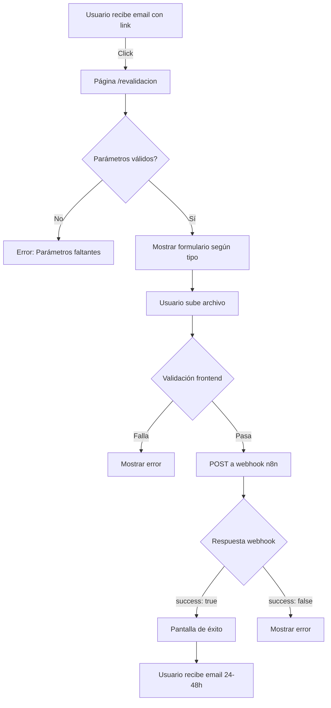

# 🔄 Sistema de Re-validación - Integración con Webhook n8n

## 📋 Contexto

Este módulo maneja la **re-subida de credenciales académicas o comprobantes de pago rechazados** por el CRM. Los usuarios reciben un email con un link para cargar una nueva imagen.

---

## 🔗 URLs del Sistema

### **Producción**
```
https://abogadosliberales.com/revalidacion?customer_id=831&rejected=credential
https://abogadosliberales.com/revalidacion?customer_id=831&rejected=receipt
```

### **Parámetros**
| Parámetro | Tipo | Valores | Descripción |
|-----------|------|---------|-------------|
| `customer_id` | integer | 1-999999 | ID del cliente en Supabase |
| `rejected` | string | `credential` \| `receipt` | Tipo de documento rechazado |

---

## 🎯 Casos de Uso

### **Caso 1: Credencial Académica Rechazada** 🎓
- **Motivo**: Imagen ilegible, documento falso, o no coincide con datos
- **Usuarios afectados**: Profesores, estudiantes de posgrado/licenciatura
- **Acción**: Usuario debe subir nueva foto de credencial clara

### **Caso 2: Comprobante de Pago Rechazado** 💳
- **Motivo**: Referencia incorrecta, monto no coincide, o imagen ilegible
- **Método afectado**: Solo transferencia bancaria
- **Acción**: Usuario debe subir nuevo comprobante

---

## 🚀 Integración del Webhook (PENDIENTE)

### **Estado Actual**
✅ Frontend completamente funcional (UI + validaciones)  
⏳ **Webhook de n8n pendiente** (tu compañero lo proporcionará)

### **Ubicación del Código**
Archivo: `src/components/revalidacion/Secciones/RevalidacionSeccion.jsx`  
Líneas: **78-115** (función `handleSubmit`)

### **Código Actual (Simulación)**
```javascript
const handleSubmit = async () => {
  setIsSubmitting(true);

  // 🔥 SIMULACIÓN: 2 segundos de delay
  await new Promise(resolve => setTimeout(resolve, 2000));
  
  console.log('✅ [SIMULACIÓN] Archivo enviado correctamente');
  setSubmitStatus('success');
};
```

---

## 🔌 Integración Real (Cuando Webhook Esté Listo)

### **Paso 1: Reemplazar la Simulación**

**Archivo**: `src/components/revalidacion/Secciones/RevalidacionSeccion.jsx`  
**Líneas**: 78-115

**REEMPLAZAR ESTE CÓDIGO:**
```javascript
// 🔥 SIMULACIÓN - BORRAR CUANDO WEBHOOK ESTÉ LISTO
await new Promise(resolve => setTimeout(resolve, 2000));
console.log('✅ [SIMULACIÓN] Archivo enviado correctamente');
setSubmitStatus('success');
```

**CON ESTE CÓDIGO:**
```javascript
// 🔥 INTEGRACIÓN REAL CON WEBHOOK DE N8N
const formData = new FormData();
formData.append('customer_id', customerId);
formData.append('rejected_type', rejectedType);
formData.append('file', file);

const response = await fetch('https://u-n8n.virtalus.cbluna-dev.com/webhook/congreso_nacional_reupload', {
  method: 'POST',
  body: formData
});

if (!response.ok) {
  throw new Error(t.fileValidation.uploadError);
}

const data = await response.json();
console.log('✅ Respuesta del webhook:', data);

// Verificar respuesta del backend
if (data.success) {
  setSubmitStatus('success');
} else {
  throw new Error(data.message || t.fileValidation.serverError);
}
```

---

## 📡 Especificaciones del Webhook (A Confirmar con tu Compañero)

### **Endpoint Esperado**
```
POST https://u-n8n.virtalus.cbluna-dev.com/webhook/congreso_nacional_reupload
```

### **Request Body (FormData)**
```javascript
{
  customer_id: 831,              // ID del cliente en Supabase
  rejected_type: "credential",   // "credential" | "receipt"
  file: [Binary File Data]       // Archivo JPG/PNG/PDF (máx 5MB)
}
```

**Alternativa Base64** (si prefieren):
```javascript
{
  customer_id: 831,
  rejected_type: "credential",
  file_base64: "data:image/jpeg;base64,/9j/4AAQSkZJRg...",
  file_name: "credencial.jpg",
  file_type: "image/jpeg"
}
```

### **Response Esperado**
```javascript
// Éxito
{
  success: true,
  message: "Archivo recibido correctamente",
  data: {
    customer_id: 831,
    revalidation_id: 42,
    status: "pending_revalidation"
  }
}

// Error
{
  success: false,
  message: "Error al procesar el archivo",
  error: "INVALID_FILE_TYPE"
}
```

---

## 🔍 Validaciones Actuales (Frontend)

### **Tipos de Archivo Permitidos**
- ✅ JPG / JPEG
- ✅ PNG
- ✅ PDF

### **Tamaño Máximo**
- ✅ 5 MB (5,242,880 bytes)

### **Código de Validación**
Archivo: `src/components/revalidacion/components/FileUploader.jsx`  
Líneas: **17-31** (función `validateFile`)

---

## 📊 Flujo Completo de Re-validación



---

## 🧪 Testing Manual (Mientras no hay webhook)

### **URLs de Prueba**

```bash
# Credencial rechazada
http://localhost:4321/revalidacion?customer_id=831&rejected=credential

# Comprobante rechazado
http://localhost:4321/revalidacion?customer_id=855&rejected=receipt

# Error: Parámetros faltantes
http://localhost:4321/revalidacion

# Error: Tipo inválido
http://localhost:4321/revalidacion?customer_id=831&rejected=invalid
```

### **Flujo de Prueba**
1. Abrir URL con parámetros válidos
2. Verificar que se muestra el formulario correcto (credencial o recibo)
3. Arrastrar archivo (o click para seleccionar)
4. Verificar validación de tipo y tamaño
5. Click en "Enviar para Validación"
6. Verificar mensaje "Enviando..." (2 segundos)
7. Ver pantalla de éxito

---

## 📧 Email que Envía n8n (Ejemplo)

```
Asunto: Acción Requerida - Congreso Nacional de Amparo 2025

Estimado/a [Nombre Completo],

Su registro al Congreso Nacional de Amparo y Derechos Humanos 2025 
requiere una acción adicional.

Motivo: Su credencial académica no pudo ser validada.

Por favor, acceda al siguiente enlace para cargar una nueva imagen:

👉 https://abogadosliberales.com/revalidacion?customer_id=831&rejected=credential

Una vez enviada, recibirá un correo de confirmación en las próximas 
24-48 horas con su código QR de acceso.

Si tiene alguna duda, contáctenos en soporte@abogadosliberales.com

Saludos cordiales,
Barra Mexicana de Abogados Liberales
```

---

## 🔒 Consideraciones de Seguridad

### **Validación de customer_id**
- ✅ Frontend: Verifica que existe en URL
- ⏳ **Backend**: Debe verificar que el customer_id existe en Supabase
- ⏳ **Backend**: Debe verificar que el registro tiene status "rejected"

### **Rate Limiting**
- ⏳ **Backend**: Limitar a 3 re-subidas por customer_id
- ⏳ **Backend**: Bloquear después de 3 intentos fallidos

### **Sanitización de Archivos**
- ⏳ **Backend**: Validar tipo MIME real del archivo (no solo extensión)
- ⏳ **Backend**: Escanear con antivirus si es posible
- ⏳ **Backend**: Renombrar archivo con UUID para evitar colisiones

---

## 📂 Estructura de Archivos Creados

```
src/
├── pages/
│   └── revalidacion.astro                    # ✅ Página principal
├── components/revalidacion/
│   ├── Secciones/
│   │   └── RevalidacionSeccion.jsx           # ✅ Lógica principal
│   ├── components/
│   │   ├── FileUploader.jsx                  # ✅ Drag & Drop
│   │   └── RevalidacionSuccess.jsx           # ✅ Pantalla éxito
│   └── css/
│       ├── revalidacionSeccion.module.css    # ✅ Estilos principales
│       ├── fileUploader.module.css           # ✅ Estilos uploader
│       └── revalidacionSuccess.module.css    # ✅ Estilos éxito
└── data/
    └── translationsRevalidacion.js           # ✅ ES/EN
```

---

## ✅ Checklist de Integración

### **Frontend (Completado)**
- [x] Página `/revalidacion.astro` creada
- [x] Validación de parámetros URL
- [x] Formulario con drag & drop
- [x] Validación de tipo de archivo (JPG/PNG/PDF)
- [x] Validación de tamaño (5MB máx)
- [x] Preview de imagen
- [x] Pantalla de éxito
- [x] Traducciones ES/EN
- [x] Diseño responsive
- [x] Logs de debugging

### **Backend (Pendiente - Tu Compañero)**
- [ ] Webhook `/congreso_nacional_reupload` creado
- [ ] Validación de `customer_id` en Supabase
- [ ] Almacenamiento de archivo (S3, Cloudinary, etc)
- [ ] Actualización de status en BD
- [ ] Email de notificación al equipo CRM
- [ ] Email de confirmación al usuario (24-48h)
- [ ] Logs de auditoría

---

## 🎯 Próximos Pasos

1. **Tu compañero te proporciona**:
   - URL exacta del webhook
   - Estructura de request body preferida (FormData vs Base64)
   - Estructura de response JSON
   - Credenciales de autenticación (si aplica)

2. **Tú actualizas**:
   - Reemplazar simulación en `RevalidacionSeccion.jsx` (líneas 78-115)
   - Agregar manejo de errores específicos del backend
   - Probar con archivos reales

3. **Testing conjunto**:
   - Probar flujo completo end-to-end
   - Verificar que el archivo llega correctamente
   - Verificar que el status se actualiza en BD
   - Verificar que se envía email de confirmación

---

## 📞 Contacto

**Frontend Developer**: [Tu nombre]  
**Backend Developer**: [Nombre de tu compañero]  
**Sistema**: Congreso Nacional de Amparo 2025

---

**Estado**: ✅ Frontend completo | ⏳ Backend pendiente  
**Última actualización**: 29 de octubre de 2025
